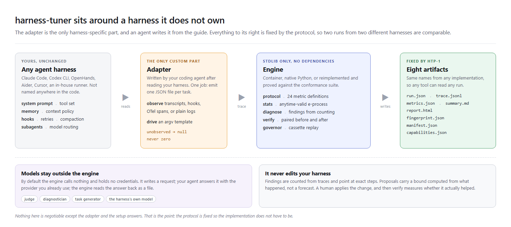
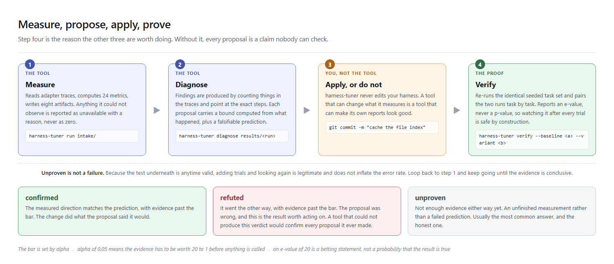
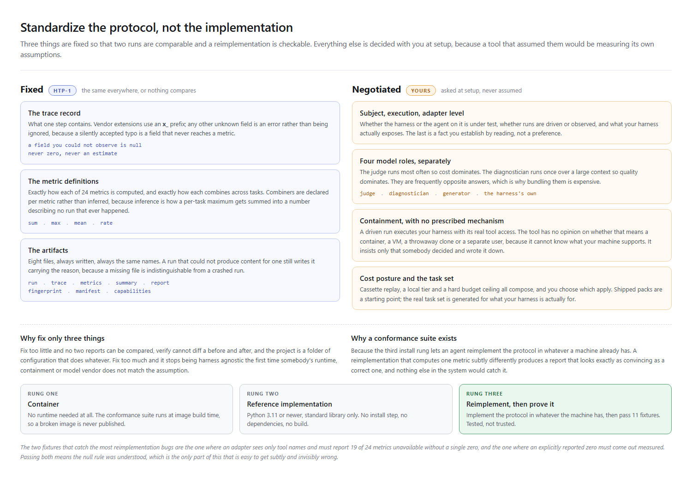

<h1 align="center">harness-tuner</h1>

<p align="center">
  <strong>Measure your agent harness. Find where it wastes the model. Prove the fix worked.</strong><br>
  Harness agnostic, agent agnostic, machine agnostic. Set it up by saying one sentence to your coding agent.
</p>

<p align="center">
  <a href="https://github.com/csnyder256/harness-tuner/actions/workflows/ci.yml"></a>
  <a href="LICENSE"></a>
  <a href="AGENT-GUIDE.md"></a>
  <a href="#install-pick-a-rung"></a>
  <a href="https://github.com/csnyder256/harness-tuner/pkgs/container/harness-tuner"></a>
  <a href="https://github.com/csnyder256/harness-tuner/stargazers"></a>
</p>

<p align="center">
  If this saves you an argument about whether a change helped, a star helps other people find it.
</p>



---

## What it does

Your agent harness is the scaffolding around the model: the system prompt, the tool set and how the tools are described, the memory and context policy, the hooks, the retries, the compaction. Most of the difference between a harness that feels sharp and one that feels expensive lives there, and almost none of it is measured.

harness-tuner measures it. It reads traces from **any** harness through a small adapter, computes a fixed set of operational metrics, tells you where the harness is spending the model's capability on nothing, and writes proposals you can apply. Then it does the part nobody else does: it tells you, with a real statistical guarantee, whether the change you applied actually helped.

It never edits your harness. It proposes; you decide.

## Install: pick a rung

Work down this list and stop at the first that fits your machine. "Machine agnostic" needs more than one answer, because a laptop, a locked-down build box, and a CI runner are genuinely different problems.

**1. Container.** Needs no runtime at all.

```bash
docker run --rm -v "$PWD:/work" -w /work ghcr.io/csnyder256/harness-tuner:latest doctor
```

**2. The reference implementation.** Needs Python 3.11 or newer and nothing else: zero dependencies, nothing to compile. Run it from a clone, or install it as a command. The installed command bundles the packs, the conformance suite and the agent guide, so it works from any directory.

```bash
# from a clone, no install step
git clone https://github.com/csnyder256/harness-tuner && cd harness-tuner
python -m harness_tuner doctor

# or as a command on your PATH (either one)
pipx install git+https://github.com/csnyder256/harness-tuner
uvx --from git+https://github.com/csnyder256/harness-tuner harness-tuner doctor
```

Each [release](https://github.com/csnyder256/harness-tuner/releases) also attaches a wheel, which `pip install` accepts directly on a machine that cannot reach GitHub's git endpoint.

**3. Reimplement it.** No container runtime and no suitable Python? Implement the protocol in whatever your machine does have, then prove your implementation is correct against the shipped conformance suite.

```bash
python -m harness_tuner conformance
```

Then, whichever rung you took, put [`AGENT-GUIDE.md`](AGENT-GUIDE.md) in your project (`harness-tuner guide` writes the copy that matches your installed version; from a clone, just copy the file) and tell your coding agent:

> Follow the agent protocol, and set this up for our harness.

It reads your harness, works out what it can and cannot see, asks you the questions only you can answer (which model judges, which model diagnoses, what containment your machine supports, what your harness is actually for), and writes the adapter. There is no SDK to learn and no integration to maintain.

## The loop

```bash
python -m harness_tuner run intake/ --out results/            # measure
python -m harness_tuner diagnose results/<run>                # find and propose
#                                                               apply a proposal, or do not
python -m harness_tuner run intake/ --out results/            # re-run the same tasks
python -m harness_tuner verify --baseline results/<a> --variant results/<b>
```



---

## Three claims, and what keeps each one honest

Every evaluation tool makes these claims. The interesting question is what stops each one from quietly becoming false, because all three fail silently and none of them fails loudly.

### Claim 1: it measures your harness

**How that goes wrong:** a metric the adapter could not observe gets reported as zero. A harness whose adapter cannot see caching then looks identical to one that genuinely caches nothing, and the tool has invented a finding out of a gap in its own instrumentation.

**What prevents it:** a value that could not be observed is `null`, and `null` becomes `unavailable` carrying a reason you can act on. Never zero, never an estimate, never a plausible default. A metric that is *undefined* rather than merely unobserved also says so and says which, so a recovery rate over zero errors reports "undefined" instead of a perfect score, and a harness that never got far enough to fail cannot outrank one that failed and recovered.

Two conformance fixtures exist only to pin this. In one, an adapter that sees nothing but tool names must report nineteen of twenty-four metrics unavailable and may not report a single zero. In the other, an adapter that explicitly reports zero cache hits must produce a *measured* zero, because that is a real finding about the harness rather than a gap in the adapter.

The same rule governs the report itself. `summary.md` leads with what could not be measured, and separately with what was measured in only some of the tasks, because a report that buried its blind spots reads as a complete picture of the harness. `doctor` is a whole command devoted to listing what your install cannot do.

### Claim 2: it tells you what to change

**How that goes wrong:** a model is handed a trace and asked to find problems. It finds problems. It would find problems in any trace, and none of them come with a step number.

**What prevents it:** detection is arithmetic, not judgement. Every finding is produced by counting things in the trace and carries the exact steps it came from, so you can check it against the raw records. The diagnostician model is given a much narrower job, and is explicitly instructed not to add findings of its own: it says which part of *your* harness would be changed, because it has read your harness and the engine has not.

Proposals carry a **bound**, not a forecast. "At most nine of these reads were avoidable, because each had already been performed earlier in the same task" is arithmetic on what happened. "Expected gain: 12%" is a number nobody can check, and this project exists partly as a reaction to that kind of number.

### Claim 3: it proves the change helped

**How that goes wrong:** you run the harness twice, the second number is better, and you believe it. Agent runs are noisy enough that this is close to a coin flip. The usual fix is a fixed sample size chosen in advance and a p-value computed once at the end, which fails here for two reasons: trials cost real money, and you are going to look at the running result whether or not the method permits it. With a p-value, looking and then continuing inflates the error rate silently.

**What prevents it:** an anytime-valid e-process. Each paired trial is a bet on the variant, wealth accumulates multiplicatively, and Ville's inequality bounds the probability that it *ever* crosses the threshold, at any stopping time, checked as often as you like. Watching the number after every single trial is safe by construction rather than by discipline. The bet size is not tuned on the data; a fixed grid of bets is run in parallel and averaged, which keeps the guarantee.

`verify` reports an **e-value**, never a p-value. An e-value of 20 means the evidence is worth 20 to 1 against the null. It is a betting statement, and it is the honest one. It returns one of three answers: confirmed, refuted, or unproven, and unproven is a real answer that means "add more trials", not "it failed".

---

## What it deliberately does not do

Shorter than the feature list, and more informative.

**It publishes no numbers about anybody's harness.** There is no leaderboard here and there never will be. Rankings between products go stale within weeks, invite methodology fights, and are almost always run by someone with a stake. Every number this tool produces is produced by you, on your machine, about your harness.

**It does not apply its own proposals.** A tool that can change the thing it measures is a tool that can make its own reports look good. The proposal names the file, the human makes the commit, and `verify` says whether it worked.

**It does not call a model by default.** The engine writes a request, your agent answers it with whatever provider and keys you already have, and the engine reads the answer back as a file. No credential store, no vendor SDK to go stale, and it works identically against a frontier API, a local server, or a person filling in the file by hand. A direct-call path exists if you want one command instead of a conversation, and it is the only place in the codebase with a dependency.

**It does not skip tasks on a guess.** A task your harness structurally cannot run is skipped and *counted*, never scored as a failure. A harness with no browser is not worse at browsing than one with a broken browser. And with no capability scan present, nothing is skipped at all, because silently shrinking the task set would inflate every rate computed from it.

**It does not have an opinion about your containment.** Drive mode executes your harness with its real tool access, so it insists you record what that can reach and approve it. It does not insist on Docker, or a VM, or anything else, because it cannot know what your machine supports.

## HTP-1, in one screen

Everything above is negotiated with you at setup. Three things are fixed, and they are what make two runs comparable and a reimplementation checkable.

| Fixed | What it pins |
|---|---|
| **The trace record** | The fields one step contains, including the rule that an unobserved field is `null`. Vendor extensions use an `x_` prefix; any other unknown field is an error rather than being ignored. |
| **The metric definitions** | Exactly how each of 24 metrics is computed, including how each combines across tasks. Combiners are declared per metric, not inferred, because inferring them is how a per-task maximum ends up summed into a number that describes no run that ever happened. |
| **The artifacts** | The eight files every run writes and what they are called. A run that could not produce content for one still writes it, carrying the reason, because a missing file is indistinguishable from a crashed run. |

```
run.json  trace.jsonl  metrics.json  summary.md
report.html  fingerprint.json  manifest.json  capabilities.json
```

Any tool that reads those eight files can consume a run from any HTP-1 implementation. The specification is Part 2 of [`AGENT-GUIDE.md`](AGENT-GUIDE.md), and `conformance/` holds the fixtures plus the exact values a correct implementation produces from them.



## How it compares

The evaluation space is busy, and almost all of it sits one layer down from this. Most tools evaluate the *agent you built*. This one evaluates the *harness underneath it*, and is portable enough to be part of any harness.

| | What it is | How harness-tuner relates |
|---|---|---|
| **Braintrust, Langfuse, LangSmith** | Hosted LLM observability and output scoring | They are excellent at tracing and grading what your agent produced. They are products with a control plane; this is a file you copy in that publishes nothing and phones nowhere. |
| **DeepEval, Promptfoo, Ragas** | Open-source scoring libraries for LLM output | They score answers. This scores the scaffolding: rework, loops, cache behaviour, context growth, recovery. Complementary rather than competing. |
| **AgentBench, SWE-bench, tau-bench** | Academic benchmarks with fixed task sets and leaderboards | They rank models on shared tasks. This ranks nothing, and generates a task set for what your harness is actually for, because a generic benchmark measures how well your harness impersonates someone else's. |
| **OpenTelemetry, OpenInference** | Tracing conventions for LLM applications | Genuinely adjacent, and a fine source for an adapter to read. They standardize how a span is shaped; HTP-1 standardizes what a harness must expose to be *evaluated*, plus the metric definitions and artifact names that make two runs comparable. |
| **Your own eval script** | The thing most teams actually have | Usually the right starting point, and usually missing the same three things: unavailable-versus-zero discipline, a statistical test that survives being watched, and a way to prove a change helped rather than assuming it. |

## FAQ

**Does this work with Claude Code, Codex CLI, OpenHands, Cursor, Aider, or my in-house runner?** Yes, and none of them are named in the code. The adapter your agent writes is the only harness-specific part, and its whole job is to emit one JSON file per task. If a harness leaves any record of what it did, down to a plain text log, it can be measured, and the report says exactly what that costs you in metrics.

**What if my harness exposes almost nothing?** Then you get an L0 adapter, and roughly a third of the metrics report unavailable with a reason each. That is a useful result rather than a failure, and `doctor` will tell you before you run anything. Loop detection, step counts and tool-sequence analysis all still work, and those are frequently where the largest recoverable waste is.

**Do I have to run real, expensive tasks every time?** No. Record a driven run once and every later run replays from the cassette, free and byte-deterministically. That is what makes results reproducible by a colleague with no API key, and what makes this practical in CI.

**Why an e-value and not a p-value?** Because you are going to look at the running comparison, and with a p-value looking and then continuing to gather data inflates the error rate silently. An e-process removes the problem instead of asking you not to peek. It also stops early when the answer is obvious, which matters when each trial costs money.

**Is the Harness DNA fingerprint just vibes?** It is a stated function of measured values, and the scales are published in the artifact next to every score they produced. They are declared opinions about what good looks like, not measurements, and they are printed so you can disagree with a specific number rather than with a mood. A dimension whose inputs were all unavailable renders as "insufficient evidence" rather than falling back to a middle score, and a run with too few tasks renders no scores at all.

**Can I trust a reimplementation of the protocol?** Only if it passes `conformance`. That is exactly why the suite ships: a reimplementation that computes one metric subtly differently produces a report that looks just as convincing as a correct one, and nothing else in the system would catch it.

**Is there a leaderboard?** No, and there will not be one. See [What it deliberately does not do](#what-it-deliberately-does-not-do).

## Keywords and related topics

Relevant if you are searching for any of these: agent harness evaluation, LLM agent evaluation, agent observability, context engineering, prompt caching, cache hit ratio, context window management, context compaction, agent memory evaluation, tool selection accuracy, loop detection, agent reliability, LLM cost governance, token budget, budget governor, cost per task, step efficiency, trace analysis, OpenTelemetry for LLMs, OpenInference, LLM as judge, deterministic scoring, regression gates for agents, CI for AI agents, prompt injection resilience, agent safety evaluation, multi-agent memory contamination, anytime-valid inference, e-values, e-process, sequential testing, always-valid p-values, Ville's inequality, test martingale, reproducible evaluation, record and replay, evaluation harness, agent benchmark, harness evaluation protocol.

Adjacent to Braintrust, Langfuse, LangSmith, DeepEval, Promptfoo, Ragas, AgentBench, SWE-bench and tau-bench, and a companion to any harness including Claude Code, Codex CLI, OpenHands, Aider, Cursor and in-house runners.

## Related

- [RAG-OS](https://github.com/csnyder256/RAG-OS), a blueprint for a personal always-on AI agent.
- [org-memory-os](https://github.com/csnyder256/org-memory-os), one shared permission-aware AI memory for an organization. The `org` pack here stops at what a harness trace can show; the architecture behind it lives there.

## Contributing

Issues and pull requests welcome. The most useful contributions: an adapter for a harness nobody has written one for yet, an evaluation pack for a domain the shipped ones miss, a metric definition with a conformance fixture that pins it, or a case where a finding was wrong and the trace that proves it. See [CONTRIBUTING.md](CONTRIBUTING.md).

## License

MIT. Use it, fork it, build on it, sell what you build with it.
